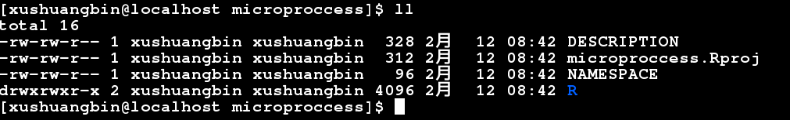

## skeleton

+ `devtools::create()` 生成包骨架
+ `usethis::use_code_of_conduct()` 生成Code of Conduct文件，大概讲一下如果贡献代码，不要有性别、种族歧视，不要有冒犯别人的话语等。
+ `usethis::use_tidy_thanks()` 爬一个github，看谁给你贡献了代码，可以加到README中，致谢一下。

## optimization

+ [itdepends: 优化包的依赖关系](https://github.com/jimhester/itdepends)
+ [profviz: interactive visualization for profiling R code](https://rstudio.github.io/profvis/)

## example
+ `devtools::create(path="./microproccess")` microproccess 是我命名的包的名字, 这步生成的骨架结构如下图

 - DESCRIPTION 文件中包含Package的名字, Title, Version, [Author](https://journal.r-project.org/archive/2012-1/RJournal_2012-1_Hornik~et~al.pdf), Description, Depends, License, Encoding.
 - NAMESPACE 文件不需要编辑。
 - R 文件夹为存放R函数的地方。这里我放一个droptax函数（一个去除低丰度低频率物种的函数)  

```
#' @title Dropping Species with Few abundance and Few Occurrences 
#' 
#' @description 
#' Drop species or features from the feature data frame that occur fewer than or equal to a threshold number of 
#' occurrences and fewer abundance than to a threshold abundance. 
#' 
#' @param taxtab dataframe; a dataframe of species (or features), default is (n_sample, n_feature). 
#' @param rmode boolean; whether transpose the taxtab, default is False. 
#' @param minocc numeric; the threshold number of occurrences to be dropped, if < 1.0, 
#' it will be the threshold ratios of occurrences, default is 0. 
#' @param minabu numeric: the threshold abundance, if fewer than the threshold will be dropped, default is 0. 
#' @return a list contained feature dataframe dropped, and the call, arguments. 
#' @export 
#' @author Shuangbin Xu 
#' @examples 
#' 
#' library("microproccess") 
#' data <- read.csv(system.file("data", package="microproccess", "Baxter_16_crc_genera_group.csv.gz")) 
#' data$Group <- NULL 
#' dim(data) 
#' head(data) 
#' newdat <- droptax(data, rmode=FALSE, minocc=0.2, minabu=0) 
#' dim(newdat) 
#' head(newdat) 
 
droptax <- function(taxtab, rmode=FALSE, minocc=0, minabu=0){ 
       if (isTRUE(rmode)){ 
              taxtab <- data.frame(t(taxtab), check.names=FALSE) 
       } 
       if (minocc < 1.0){ 
              minocc <- round(dim(taxtab)[1]*minocc, 0) 
       } 
       taxtab <- taxtab[,apply(taxtab>minabu,2,sum)>=minocc] 
       attr(taxtab, "call") <- match.call() 
       attr(taxtab, "rmode") <- rmode                            
       attr(taxtab, "minocc") <- minocc                          
       attr(taxtab, "minabu") <- minabu                          
       return (taxtab)                                           
}
```
+ 可以用[roxygen2](https://github.com/yihui/roxygen2)编写函数使用方法。主要是以#' 开头，包含@title, @description, @param, @return, @export, @author, @examples. 
+ 编写[README](https://gist.github.com/PurpleBooth/109311bb0361f32d87a2#project-title)，用markdown写。
+ 编写[Makefile](https://github.com/xiangpin/MetaMicrobiome/blob/master/Makefile)

```
PKGNAME := $(shell sed -n "s/Package: *\([^ ]*\)/\1/p" DESCRIPTION)
PKGVERS := $(shell sed -n "s/Version: *\([^ ]*\)/\1/p" DESCRIPTION)
PKGSRC  := $(shell basename `pwd`)
       
all: rd pdf check clean
       
rd:    
       Rscript -e 'library(methods); devtools::document()'
       
pdf: rd
       R CMD Rd2pdf --no-preview --force ../$(PKGSRC)
       
build: pdf
       cd ..;\
       R CMD build $(PKGSRC)
       
check: build
       cd ..;\
       R CMD check --as-cran $(PKGNAME)_$(PKGVERS).tar.gz
       
install: check
       cd ..;\
       R CMD INSTALL $(PKGNAME)_$(PKGVERS).tar.gz
       
clean: 
       cd ..;\
       rm -rf $(PKGNAME).Rcheck
```
+ 检查，测试. 终端运行：

```
make
```
+ 更多的参考资料如下：<http://r-pkgs.had.co.nz/>, <https://cran.r-project.org/doc/contrib/Leisch-CreatingPackages.pdf>, <http://dirk.eddelbuettel.com/papers/r_package_development_nov2014.pdf>, 或者google 搜索 R package development tutorial。
+ 编程开发习惯：<https://style.tidyverse.org>
